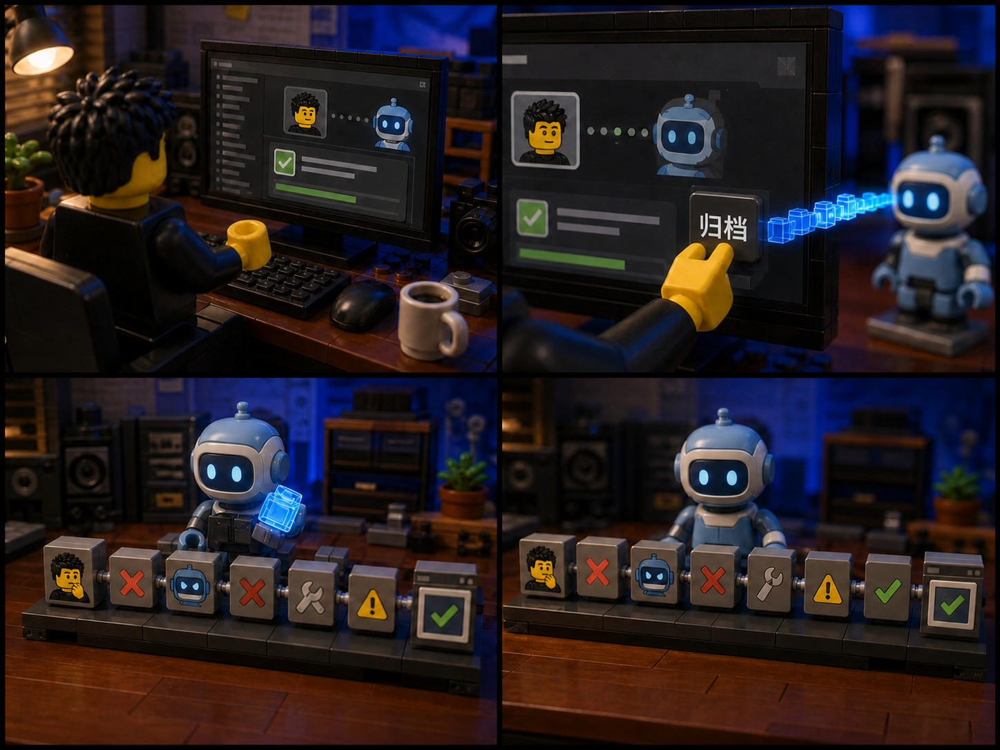

<div align="center">

# VidMuse Video Creator

### From one-time authorization to delivered images, videos, and B-roll

[简体中文](README.md) · [繁體中文](README.zh-TW.md) · [日本語](README.ja.md) · [한국어](README.ko.md)

<a href="https://vidmuse.ai/"></a>

**Built and maintained by Erduo · Supported through collaboration and sponsorship from VidMuse**

[Sign up / Sign in](https://vidmuse.ai/login) · [Official CLI](https://vidmuse.ai/en/cli) · [Current plans](https://vidmuse.ai/en/pricing)

</div>

## Partner and sponsor: VidMuse

Special thanks to **[VidMuse](https://vidmuse.ai/)** for collaborating on and sponsoring this open-source Skill. VidMuse provides account access, the official CLI, cloud models, and generation services; this repository turns those capabilities into a workflow that agents can operate, resume, and carry through to delivery.

> The Logo above comes from the official VidMuse website. Its copyright and trademark remain with the VidMuse Team / SandAI and are not covered by this repository's MIT License.


VidMuse Video Creator is an Agent Skill that installs and operates the official VidMuse CLI. After one browser or device authorization, an agent can discover live models, estimate credits, generate images or videos, build SRT-driven B-roll, track asynchronous tasks, download results, and produce a delivery receipt.

## Install

```bash
npx skills add erduo1998-cell/vidmuse-video-creator \
  --skill vidmuse-video-creator \
  -g -a codex -a claude-code --copy -y
```

## First run

Tell your agent:

```text
Use $vidmuse-video-creator to complete first-time setup.
Run only zero-credit readiness checks and do not submit paid generation.
```

The Skill checks the CLI, opens the official signup/login flow when needed, verifies the plan query, and confirms that live image or video models are available. Registration and consent remain user-controlled. Credentials stay in the user's CLI session and never enter the project or Git.

## Real generation case: storyboard → video

This is not a storyboard recreated after the fact. The four-panel image below is the actual reference storyboard submitted to VidMuse + MiniMax H3 for this clip.

**1. Actual storyboard used**



The panels show: task completed → archive and transfer the data → AI receives the full record → human errors, AI errors, tool failures, and later corrections become one traceable chain.

**2. Actual generated result**


[Download the 4096×3072 delivery example](docs/demos/vidmuse-h3-4k-demo.mp4) · [View the output still](docs/images/vidmuse-h3-demo-poster.jpg) · [Case and media notes](docs/demos/README.md)

## Example prompts

```text
Use $vidmuse-video-creator to turn product.png into a six-second 16:9 product ad.
Keep the estimate below 60 credits, track it to terminal success, and download the file.
```

```text
Use $vidmuse-video-creator to read talk.srt, understand the full argument,
select only segments that need visual explanation, and deliver coherent B-roll clips.
```

## Completion standard

Readiness requires a working CLI, valid login, successful plan query, and a non-empty live model list. Generation is complete only when the remote task succeeds and a non-empty file has been downloaded and opened. A task ID alone is not a finished result.

## Privacy and spending

- Authentication remains in the user-level VidMuse CLI session.
- Private inputs, task state, project IDs, and outputs are excluded from Git by default.
- Paid requests lock the model, parameters, quantity, and estimated credits first.
- Existing task IDs are polled instead of blindly resubmitted.
- Upload only media you have the right to use.

## Brand and service boundary

The VidMuse commercial service, official CLI, names, and trademarks are maintained by the VidMuse Team / SandAI. This repository does not contain the VidMuse service or CLI source and is not an official support channel.

## Contact

For Skill collaboration, video workflows, or commercial projects, add Erduo on WeChat. This is Erduo's personal business contact, not VidMuse support:


Original Skill code and documentation are released under the [MIT License](LICENSE). See [NOTICE.md](NOTICE.md) for trademarks and media.
