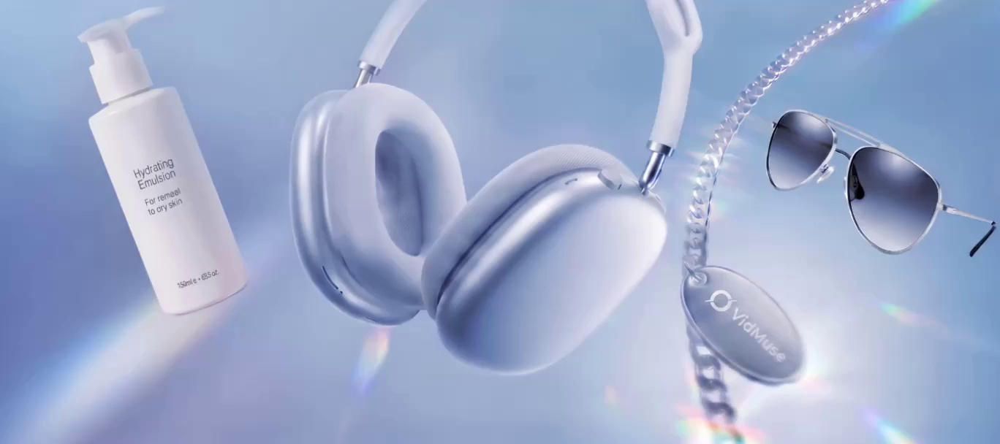
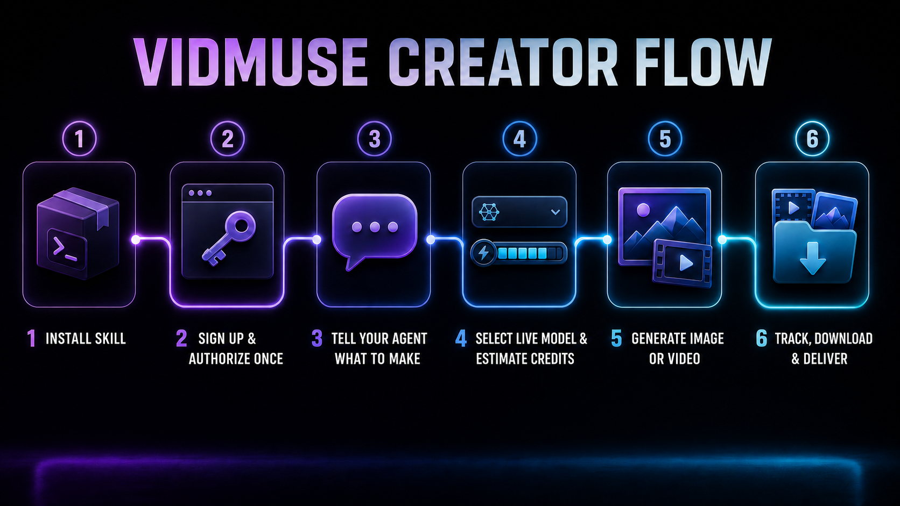

<div align="center">

# VidMuse Video Creator

### 一度の認証で、画像・動画・B-roll の納品まで Agent が実行

[简体中文](README.md) · [English](README.en.md) · [繁體中文](README.zh-TW.md) · [한국어](README.ko.md)

<a href="https://vidmuse.ai/"></a>

[VidMuse に登録 / ログイン](https://vidmuse.ai/login) · [公式 CLI](https://vidmuse.ai/en/cli)

</div>

## パートナー／スポンサー：VidMuse

[](https://vidmuse.ai/)

このオープンソース Skill の共同開発とスポンサー支援を行っていただいた **[VidMuse](https://vidmuse.ai/)** に、心より感謝します。VidMuse はアカウント、公式 CLI、クラウドモデル、生成サービスを提供し、本リポジトリはそれらを Agent が操作・再開・納品まで実行できるワークフローにまとめています。

> 上記の Logo とプラットフォーム画像は VidMuse 公式サイトの素材です。著作権と商標は VidMuse Team / SandAI に帰属し、本リポジトリの MIT License には含まれません。



この Agent Skill は VidMuse 公式 CLI をインストールして操作します。ブラウザまたはデバイスで一度認証すれば、Agent が最新モデルとクレジットを確認し、画像・動画の生成、SRT ベースの B-roll 制作、タスク追跡、ダウンロード、納品記録まで進められます。

## インストール

```bash
npx skills add erduo1998-cell/vidmuse-video-creator \
  --skill vidmuse-video-creator \
  -g -a codex -a claude-code --copy -y
```

## 初回実行

```text
$vidmuse-video-creator を使って初期設定を完了してください。
クレジットを使わない準備確認だけを行い、有料生成は実行しないでください。
```

CLI、ログイン、プラン照会、最新の画像または動画モデル一覧がすべて確認できた時点で準備完了です。認証情報はユーザーの CLI セッションだけに保存され、プロジェクトや Git には入りません。

## 実際の生成例


[4096×3072 の納品例をダウンロード](docs/demos/vidmuse-h3-4k-demo.mp4) · [静止画プレビュー](docs/images/vidmuse-h3-demo-poster.jpg) · [メディア説明](docs/demos/README.md)

## ブランドとサービスの範囲

VidMuse の商用サービス、公式 CLI、名称、商標は VidMuse Team / SandAI が管理します。本リポジトリは公式 CLI のソースや公式サポート窓口ではありません。

Skill の共同開発、動画ワークフロー、商用プロジェクトについては、Erduo の個人ビジネス用 WeChat から連絡できます。VidMuse の公式サポート窓口ではありません。


オリジナルの Skill、スクリプト、文書は [MIT License](LICENSE) で公開されています。商標とメディアについては [NOTICE.md](NOTICE.md) を参照してください。
