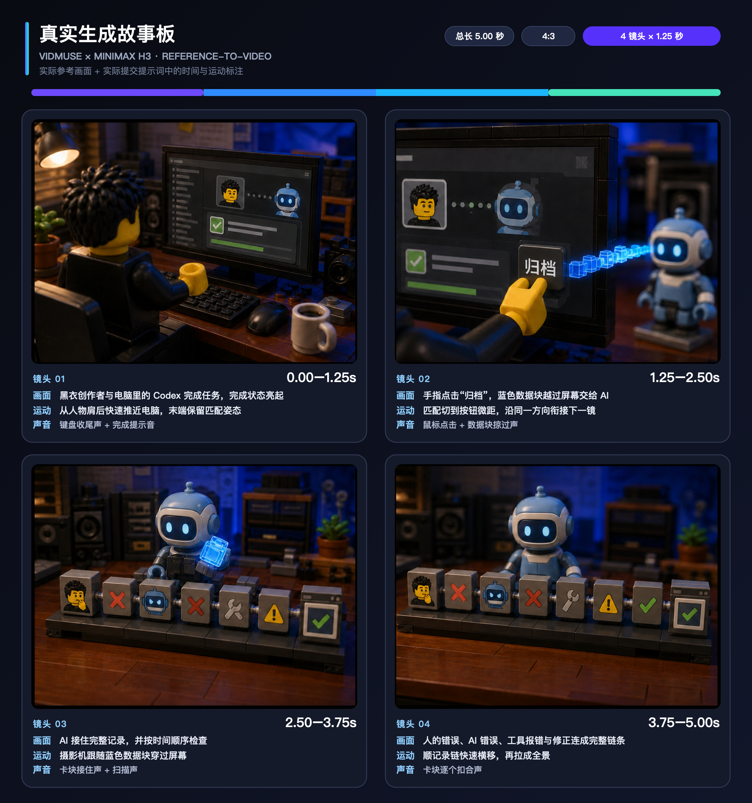

<div align="center">

# VidMuse Video Creator

### 一次授權，讓 Agent 直接交付圖片、影片與 B-roll

[简体中文](README.md) · [English](README.en.md) · [日本語](README.ja.md) · [한국어](README.ko.md)

<a href="https://vidmuse.ai/"></a>

[註冊 / 登入 VidMuse](https://vidmuse.ai/login) · [官方 CLI](https://vidmuse.ai/zh-TW/cli)

</div>

## 合作夥伴與贊助商：VidMuse

特別感謝 **[VidMuse](https://vidmuse.ai/)** 對本開源 Skill 的合作與贊助支持。VidMuse 提供平台帳號、官方 CLI、雲端模型與生成服務；本倉庫將這些能力整理成 Agent 可直接操作、可恢復並交付成品的工作流程。

> 上方 Logo 來自 VidMuse 官方網站，著作權與商標歸 VidMuse Team / SandAI；僅用於展示合作關係與介紹贊助平台，不屬於本倉庫的 MIT 開源素材。


本 Skill 會安裝並操作 VidMuse 官方 CLI。使用者完成一次瀏覽器或裝置授權後，Agent 就能查詢即時模型與點數、生成圖片或影片、製作 SRT B-roll、追蹤非同步任務、下載成品並留下交付紀錄。

## 安裝

```bash
npx skills add erduo1998-cell/vidmuse-video-creator \
  --skill vidmuse-video-creator \
  -g -a codex -a claude-code --copy -y
```

## 第一次執行

```text
使用 $vidmuse-video-creator 完成首次設定，只做零點數檢查，不要提交付費生成。
```

準備完成必須同時確認：CLI 可執行、登入有效、方案查詢成功、即時圖片或影片模型清單非空。登入憑證只留在使用者自己的 CLI 會話，不會寫入專案或 Git。

## 真實生成參考案例：故事板 → 成片

真實生成時同時使用了兩部分：四格參考圖，以及同一次提交中寫明時間、畫面、運動和聲音的提示詞。下面將兩者合成一張完整執行故事板，所有標註都來自當時的真實生成紀錄，不是事後補寫。

**1. 實際生成執行故事板**



[查看當時原樣提交的四格參考圖](docs/demos/vidmuse-h3-storyboard.png)

**2. 實際生成結果**


[下載 4096×3072 的 4K 交付示例](docs/demos/vidmuse-h3-4k-demo.mp4) · [查看成片靜幀](docs/images/vidmuse-h3-demo-poster.jpg) · [案例與媒體說明](docs/demos/README.md)

## 品牌與服務邊界

VidMuse 商業服務、官方 CLI、名稱與商標由 VidMuse Team / SandAI 維護；本倉庫不包含官方服務或 CLI 原始碼，也不是官方客服管道。

以下為耳總個人商務聯絡入口，並非 VidMuse 官方客服：


原創 Skill、腳本與文件使用 [MIT License](LICENSE)。商標與媒體說明見 [NOTICE.md](NOTICE.md)。
